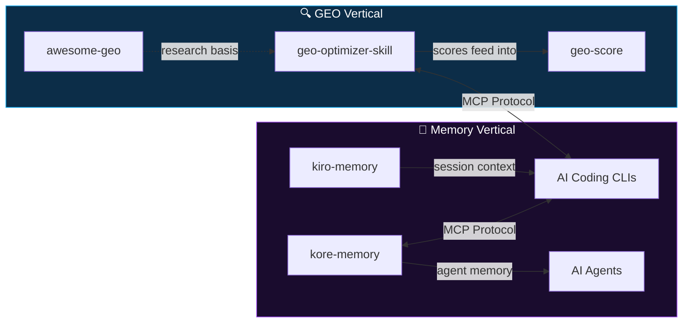

<div align="center">

<picture>
  <source media="(prefers-color-scheme: dark)" srcset="https://capsule-render.vercel.app/api?type=venom&height=180&color=0:0f172a,50:0ea5e9,100:a855f7&text=Auriti%20Labs&fontColor=ffffff&fontSize=44&fontAlignY=45&animation=fadeIn" />
  
</picture>

<br/>

**Open-source tools for the AI era.**<br/>
**We don't build wrappers. We build infrastructure.**

<br/>

<a href="https://auritidesign.it"></a>
<a href="https://x.com/JuanAuriti"></a>
<a href="mailto:juancamilo.auriti@gmail.com"></a>

</div>

<br/>

## The thesis

Search is being eaten by AI. Websites optimized for Google still don't exist for ChatGPT, Perplexity, or Claude. Meanwhile, AI coding assistants forget everything the moment you close the terminal.

We're fixing both problems.

**Two verticals. One mission: make AI work better — for users and for developers.**

```
GEO vertical     →  Make websites visible to AI search engines
Memory vertical  →  Give AI agents persistent, human-like memory
```

---

## 🔍 GEO Vertical — Generative Engine Optimization

> *"If an AI can't cite your website, you don't exist."*

### [`geo-optimizer-skill`](https://github.com/Auriti-Labs/geo-optimizer-skill) — The toolkit

The first open-source GEO audit and optimization engine. Based on the [Princeton KDD 2024](https://arxiv.org/abs/2311.09735) research paper + AutoGEO ICLR 2026 methods.

<details>
<summary><b>Technical deep dive</b></summary>
<br/>

**Scoring engine** — Weighted 0–100 score across 8 categories:
| Category | What it checks |
|---|---|
| `robots.txt` | AI bot access (GPTBot, ClaudeBot, PerplexityBot, etc.) |
| `llms.txt` | AI-readable site index — the new `sitemap.xml` for LLMs |
| `JSON-LD Schema` | Structured data richness and validity |
| `Meta tags` | SEO signals that AI engines actually parse |
| `Content quality` | Heading hierarchy, content depth, readability |
| `AI signals` | Citations, authoritative language, E-E-A-T markers |
| `AI discovery` | Discoverability across ChatGPT, Perplexity, Claude, Gemini |
| `Brand coherence` | Consistent entity representation across the site |

**MCP integration** — 10 tools exposed via FastMCP:
`geo_audit` · `geo_fix` · `geo_llms_generate` · `geo_citability` · `geo_schema_validate` · `geo_compare` · `geo_ai_discovery` · `geo_check_bots` · `geo_trust_score` · `geo_negative_signals`

**Security** — Anti-SSRF hardened. All URLs validated via DNS pinning. Streaming responses with 10MB size limit. No direct `requests.get()` — ever.

**47 citability methods** derived from Princeton + ICLR research for improving AI citation probability.

</details>

<p>


</p>

### [`geo-score`](https://github.com/Auriti-Labs/geo-score) — The measurer

AI visibility score 0–100. Five categories, actionable recommendations. Think Lighthouse — but for AI search engines.

<p>


</p>

### [`awesome-generative-engine-optimization`](https://github.com/Auriti-Labs/awesome-generative-engine-optimization) — The knowledge base

Curated collection of GEO resources: research papers, tools, strategies, guides. The starting point for anyone entering the GEO space.

---

## 🧠 Memory Vertical — Persistent AI Memory

> *"An AI that forgets everything after each session is a tool. One that remembers is a partner."*

### [`kiro-memory`](https://github.com/Auriti-Labs/kiro-memory) — Session memory for AI CLIs

Persistent cross-session memory for AI coding assistants (Claude Code, Cursor, Windsurf, Cline). Every session starts with the context of what happened before.

<details>
<summary><b>Technical deep dive</b></summary>
<br/>

**Storage layer** — SQLite in WAL mode with 256MB memory-mapped I/O and 10K page cache. Production-grade for single-node workloads.

**Full-text search** — FTS5 virtual table on observations with auto-sync triggers. Composite indexes on `(project, decay_score)` for fast filtered retrieval.

**Embedding layer** — Optional `observation_embeddings` table with async job queue for background vector computation. Partition by `agent_id` for multi-project isolation.

**Session checkpointing** — Auto-captures context (files changed, tools invoked, decisions taken) at session start/end via hooks. Atomic transactions with `withTransaction()`.

**MCP server** — Exposes `search`, `timeline`, `get_observations`, `get_context` via stdio transport. SSE streams for the live React dashboard.

</details>

<p>


</p>

### [`kore-memory`](https://github.com/Auriti-Labs/kore-memory) — Cognitive memory for AI agents

The memory layer that thinks like a human. Remembers what matters, forgets what doesn't, never phones home.

<details>
<summary><b>Technical deep dive</b></summary>
<br/>

**Ebbinghaus decay** — True forgetting curve: `decay = e^(-t · ln2 / half_life)`. Half-life scales with importance: 7 days (trivial) → 365 days (critical). Each retrieval boosts half-life by +15%. Memories below 0.05 decay threshold are marked as forgotten.

**Multi-layer search** — Three search strategies in cascade:
1. **Semantic** — `sqlite-vec` native vectors or numpy fallback, asymmetric embeddings (separate query vs document encoders)
2. **Full-text** — FTS5 with BM25 ranking
3. **Fuzzy** — LIKE fallback for edge cases

Final ranking: `similarity × decay × importance_weight`

**Auto-importance scoring** — Keyword signal detection (password, token, decision, priority) + category baselines + length bonus. **Zero LLM calls** — runs entirely local.

**REST API** — 50+ FastAPI endpoints: save, search, timeline, graph traversal (recursive CTE), multi-agent ACL, SSE streaming, GDPR right-to-erasure, plugin hooks. Auth via auto-generated API key + agent namespace isolation.

</details>

<p>


</p>

---

## How it all connects



---

## Principles

- **Local first** — Your data stays on your machine. Zero telemetry, zero cloud dependencies.
- **Research-backed** — We implement peer-reviewed methods (Princeton KDD, ICLR), not blog post hype.
- **MCP native** — Every tool speaks [Model Context Protocol](https://modelcontextprotocol.io). Plug into any AI assistant.
- **Production grade** — WAL mode, SSRF protection, atomic transactions, namespace isolation. Not demos — infrastructure.

---

<div align="center">

<a href="https://auritidesign.it"></a>
<a href="https://x.com/JuanAuriti"></a>
<a href="mailto:juancamilo.auriti@gmail.com"></a>

<br/><br/>


</div>
