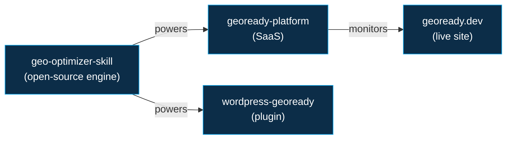

<div align="center">


<br/>

**Open-source tools for the AI era.**<br/>
**We don't build wrappers. We build infrastructure.**

<br/>

<a href="https://geoready.dev"></a>
<a href="https://x.com/JuanAuriti"></a>
<a href="mailto:juancamilo.auriti@gmail.com"></a>

</div>

<br/>

## The thesis

Search is being eaten by AI. Websites optimized for Google still don't exist for ChatGPT, Perplexity, or Claude. We're fixing that.

**One vertical. One mission: make websites visible to AI search engines.**

```
GEO vertical  →  Audit, optimize, and track AI citation readiness
SaaS layer    →  Monitoring, history, and team features on top of the engine
```

---

## 🔍 GEO Vertical — Generative Engine Optimization

> *"If an AI can't cite your website, you don't exist."*

### [`geo-optimizer-skill`](https://github.com/Auriti-Labs/geo-optimizer-skill) — The engine

The first open-source GEO audit and optimization engine. Based on the [Princeton KDD 2024](https://arxiv.org/abs/2311.09735) research paper + [AutoGEO ICLR 2026](https://arxiv.org/abs/2510.11438) methods.

**15 CLI commands** · **8 scoring categories** · **47 research-backed methods** · **7 output formats** · **1,720 tests** · MIT licensed · [PyPI](https://pypi.org/project/geo-optimizer-skill/) published · [MCP server](https://modelcontextprotocol.io) compatible · [Astro integration](https://astro.build) ready.

<details>
<summary><b>Technical deep dive</b></summary>
<br/>

**Scoring engine** — Weighted 0–100 score across 8 categories:

| Category | What it checks |
|---|---|
| `robots.txt` | AI bot access (GPTBot, ClaudeBot, PerplexityBot, etc.) |
| `llms.txt` | AI-readable site index — the new `sitemap.xml` for LLMs |
| `JSON-LD Schema` | Structured data richness and validity |
| `Meta tags` | SEO signals that AI engines actually parse |
| `Content quality` | Heading hierarchy, content depth, readability |
| `AI signals` | Citations, authoritative language, E-E-A-T markers |
| `AI discovery` | Discoverability across ChatGPT, Perplexity, Claude, Gemini |
| `Brand coherence` | Consistent entity representation across the site |

**MCP integration** — 11 tools exposed via FastMCP:
`geo_audit` · `geo_fix` · `geo_llms_generate` · `geo_citability` · `geo_schema_validate` · `geo_compare` · `geo_gap_analysis` · `geo_ai_discovery` · `geo_check_bots` · `geo_trust_score` · `geo_negative_signals` · `geo_factual_accuracy`

**Security** — Anti-SSRF hardened. All URLs validated via DNS pinning. Streaming responses with 10MB size limit. No direct `requests.get()` — ever.

**47 citability methods** derived from Princeton + ICLR research for improving AI citation probability.

**Bonus checks** — CDN crawler access, JS rendering, WebMCP readiness, negative signals (8 anti-citation patterns), prompt injection detection, trust stack score, RAG chunk readiness, content decay prediction, platform citation profiles, multimodal readiness.

</details>

<p>


</p>

### [`geoready-platform`](https://github.com/Auriti-Labs/geoready-platform) — The SaaS

Live at [geoready.dev](https://geoready.dev) — authenticated SaaS with dashboard, audit history, domain monitoring, citation tracking, drift alerts, and billing. Built on top of the open-source engine.

<p>


</p>

### [`wordpress-geoready`](https://github.com/Auriti-Labs/wordpress-geoready) — The plugin

WordPress plugin for AI visibility & Answer Engine Optimization. Generates `llms.txt` + AI discovery files and scores AI search readiness. Powered by the open-source GEO Optimizer engine.

<p>


</p>

---

## How it all connects


```mermaid
graph LR
    A["geo-optimizer-skill<br/>(open-source engine)"] -->|powers| B["geoready-platform<br/>(SaaS)"]
    A -->|powers| C["wordpress-geoready<br/>(plugin)"]
    B -->|monitors| D["geoready.dev<br/>(live site)"]
    
    style A fill:#0c2d48,stroke:#0ea5e9,color:#fff
    style B fill:#0c2d48,stroke:#0ea5e9,color:#fff
    style C fill:#0c2d48,stroke:#0ea5e9,color:#fff
    style D fill:#0c2d48,stroke:#0ea5e9,color:#fff
```

---

## Principles

- **Local first** — Your data stays on your machine. Zero telemetry, zero cloud dependencies in the CLI.
- **Research-backed** — We implement peer-reviewed methods (Princeton KDD, ICLR), not blog post hype.
- **MCP native** — The engine speaks [Model Context Protocol](https://modelcontextprotocol.io). Plug into any AI assistant.
- **Production grade** — 1,720 tests, SSRF protection, CI/CD integration, SARIF + JUnit output. Not demos — infrastructure.

---

<div align="center">

<a href="https://geoready.dev"></a>
<a href="https://x.com/JuanAuriti"></a>
<a href="mailto:juancamilo.auriti@gmail.com"></a>

<br/><br/>


</div>